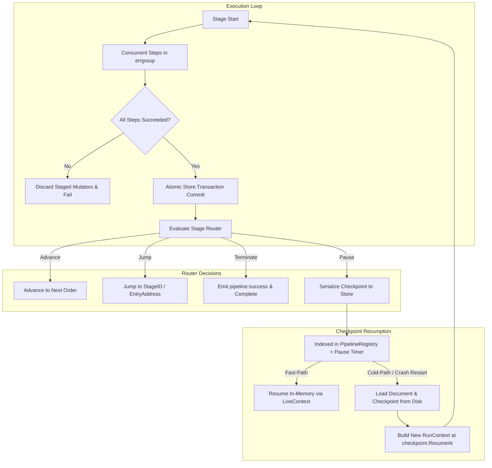

# Schema Design, Pooling & Durable Execution Rationale

**Module**: `github.com/asaidimu/pipelines`  
**Companion Document to**: `SPEC.md`

---

## 1. Schema Design Strategy: Strict Contract vs. Zero-Boilerplate

A common concern with schema-addressed storage containers is whether developers are forced to manually author AST schema definitions for every workflow. In `pipelines` on Go-Anansi, **manual schema authoring is completely optional**.

### 1.1 Developer Workflow Options

#### Option A: Struct-Derived Automatic Schemas (Zero-Boilerplate)
Users define a standard Go struct for their workflow state. The pipeline engine reflects the type, synthesizes the schema, and initializes the Anansi `DocumentPool` automatically at startup:

```go
type OrderWorkflowState struct {
    document.DocumentModel // Anansi system embed (provides _id_, _metadata_)
    OrderID      string    `json:"order_id"`
    TotalAmount  int64     `json:"total_amount"`
    IsApproved   bool      `json:"is_approved"`
    StepTrace    []string  `json:"step_trace"`
}

// Pipeline automatically compiles the DTO schema and pools containers
factory := pipeline.NewFactoryFromModel[OrderWorkflowState](definition, options)
```

#### Option B: Explicit Schema Definitions (Strict API Contracts)
When pipelines serve as enterprise boundaries, public integration endpoints, or require field-level constraints (regex, min/max, custom validation predicates), users can define an explicit Anansi schema:

```go
schema := definition.NewSchema("order-workflow").
    Field("order_id", definition.FieldTypeString, definition.Required()).
    Field("total_amount", definition.FieldTypeInteger, definition.Min(0)).
    Field("is_approved", definition.FieldTypeBoolean).
    Build()

factory := pipeline.NewFactory(definition, schema, options)
```

---

## 2. Why Schema-Backed Pooled Documents Are Superior to Dynamic JSON / `map[string]any`

| Dimension | Dynamic `map[string]any` / JSON | Anansi Schema-Backed `*document.Document` |
| :--- | :--- | :--- |
| **Memory Allocation** | Unbounded heap map allocations per step/stage | Recycled flat array buffers via `DocumentPool` |
| **GC Pressure** | High object churn & GC pause spikes under load | Near-zero allocation steady state via `sync.Pool` |
| **State Integrity** | Silent corruption on misspelled keys | Fail-fast errors on undeclared field writes |
| **Field Traversal** | Recursive map lookups ($O(N)$ string allocs) | Constant-time pre-compiled slot indexing ($O(1)$) |
| **Audit & Sanitization** | Manual payload scrubbing before logging | Built-in metadata & schema-driven field masking |
| **Serialization** | Non-deterministic map key ordering | Canonical, deterministic schema layout |

### 2.1 Deep Dive: Architectural Benefits

1. **Zero-Allocation High-Throughput Concurrency (`container.Pool`)**:
   Under heavy workload (thousands of active workflows), creating dynamic maps and unmarshaling arbitrary JSON structures creates extreme heap churn. Anansi's `DocumentPool` uses flat integer-addressed array buffers. When a stage concludes or a workflow finishes, containers are returned to the pool.
2. **Fail-Fast Boundary Validation**:
   In dynamic maps, a typo in a step action (e.g., returning `{"orderId": 123}` instead of `{"order_id": 123}`) quietly pollutes the workflow state. In Anansi, writes to undeclared fields fail immediately at the step boundary, guaranteeing state integrity.
3. **Pre-Compiled Slot Indexing (`ResolvedPath`)**:
   Accessing deep paths (e.g. `doc.Get("customer.shipping.address.zip")`) does not recursively navigate nested maps. Anansi resolves the path at compile-time to a flat integer offset, performing the retrieval in nanoseconds.
4. **Automated Field-Level Sanitization (PII Masking)**:
   Fields annotated with `anansi:"sanitize=mask"` are automatically redacted when `TimelineRecorder` streams lifecycle events or writes snapshots, eliminating PII leakage without bespoke step-level sanitization code.
5. **Deterministic Checkpointing & Time-Travel Snapshots**:
   Map serialization in Go produces non-deterministic key orders. Anansi's schema layout ensures byte-for-byte canonical reproducibility when writing checkpoints or replaying history with `TimelinePlayer`.

---

## 3. Durable Execution Architecture



### 3.1 Key Guarantees
1. **Atomic Stage Boundaries**: Mutations from concurrent steps are held in an isolated buffer and only committed to `Store` if all steps succeed. Zero partial writes on failure.
2. **Deterministic Checkpointing**: When paused, `PipelineCheckpoint` (storing `runId`, `pipelineId`, `resumeAt: EntryAddress`, `pausedAtStageId`, timestamps) is written atomically into document system metadata.
3. **Two-Tier Resumption**:
   - **Fast-Path**: In-memory resumption via `PipelineRegistry.GetLiveContext()` with zero deserialization overhead.
   - **Cold-Storage Resumption**: Reloads document state and checkpoint envelope from durable storage after process restarts.
4. **Hierarchical Subpipeline Addressing**: Deeply nested subpipelines pause and resume with recursive `EntryAddress` path targeting, skipping already-completed ancestor and sibling stages.
